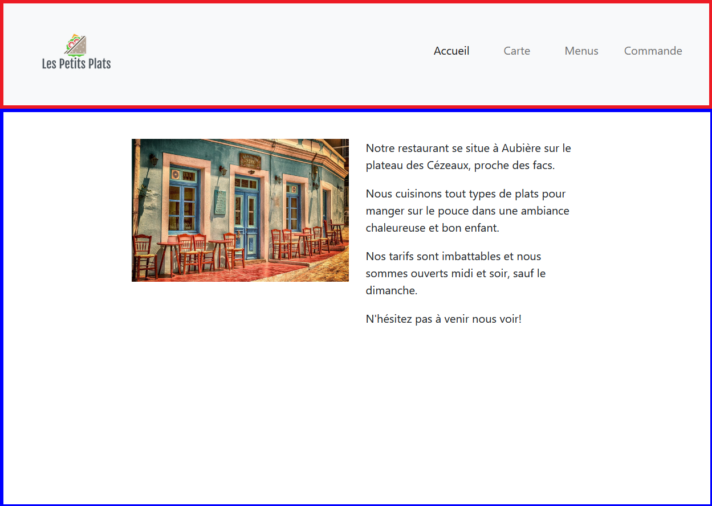
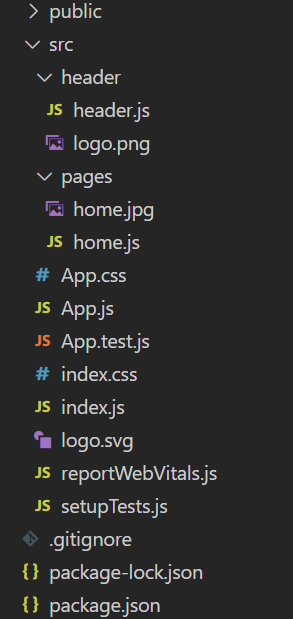

# TD-3 - Composants et Routes

Les composants React sont des fonctions Javascript comme le composant App: il s'agit d'une simple fonction qui retourne le contenu HTML à afficher, en JSX.

Décomposer la page en composants ReactJS comme dans TD3-screenshot.png: 




En rouge : le composant _Header_ qui représente l'en-tête du site.
En bleu : le composant _Home_ qui représente la page d'accueil du site.
Cette page inclue une photo de votre restaurant. Télécharger une photo libre de droit avec par exemple le site https://pixabay.com
Nommer-la `home.png`.

La structure de vos fichiers doit être la suivante:




## Le composant _Header_

Dans le fichier header.js, exporter une fonction Header qui retourne le JSX créé dans le TD2:

```
export const Header = () => {
  return /* JSX du TD2 */;
};
```

Importez-la dans le composant App et placer la balise Header dans le `return` de la fonction:

```
import { Header } from './header/header';
function App() {
  return (
    <>
      <Header />
    </>
  );
}
```

Vous devriez voir afficher le header dans votre page.
 

## Le composant _Home_

Créer de la même façon le composant Home avec votre image et le texte de votre choix.
Essayer de reproduire la disposition de la maquette.

Le composant App doit retourner:

```
function App() {
  return (
    <>
      <Header />
      <main className="w-75 mx-auto p-5">
        <Home />
      </main>
    </>
  );
}
```

## Les autres pages

Pour chacunes des entrées de menu, créer les composants correspondants dans le répertoires pages:

|Menu    |Fichier |Composant|
|--------|--------|---------|
|Accueil |home.js |Home     |
|Carte   |food.js |Food     |
|Menus   |menu.js |Menu     |
|Commande|order.js|Order    |

Pour l'instant, retourner dans chaque composant le nom de la page uniquement.

## Les Routes

Les routes sont des URL qui pointent vers des composants particuliers, gérés par un routeur.
On peut choisir différents routeur, nous allons utiliser le plus courant, à installer comme ceci:

`npm i react-router-dom`

Redémarrer l'application.

Dans App.js, il faut préciser quelles sont les routes: _path_ est l'URL relative et _element_ le composant à afficher:

```
import { BrowserRouter, Routes, Route } from "react-router-dom";

function App() {
  return (
    <BrowserRouter>
      <Header />
      <main className="w-75 mx-auto p-5">
        <Routes>
          <Route>
            <Route path="*" element={<Home />} />
            <!-- mettre ici les routes vers Menu, Cart et Order -->
          </Route>
        </Routes>
      </main>
    </BrowserRouter>
  );
}
```

Dans Header, modifier les liens de menu pour qu'ils correspondent aux _path_ définis dans le routeur.
Par exemple, le menu _Accueil_ redirige vers _/home_ :

```
import { Link } from 'react-router-dom';

...

<Link className="nav-link active" aria-current="page" to="/home">Accueil</a>
```

Chaque menu doit à présent afficher la page correspondante: Home, Menu, Cart et Order. 


