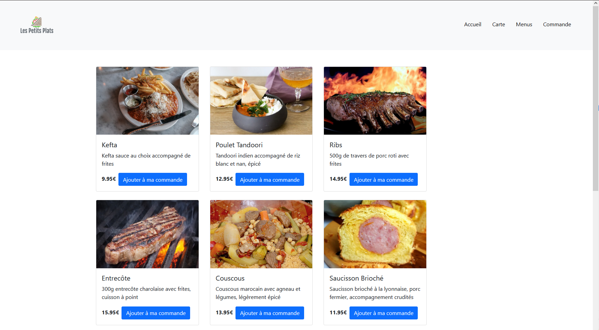
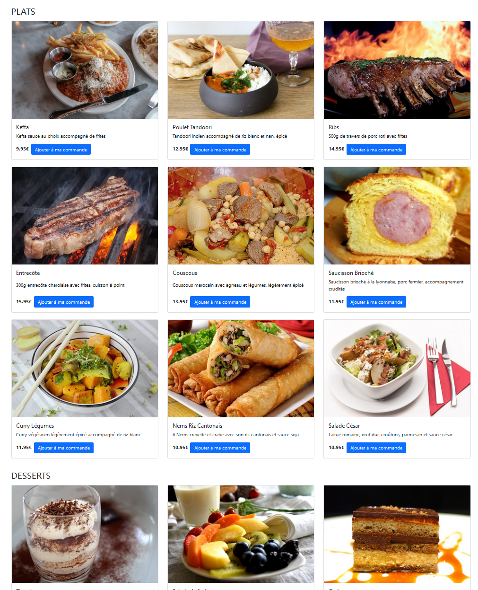

# TD5 - Promesses et API Rest

Dans ce TD, nous allons appeler une API Rest pour récupérer la carte des plats et les menus du restaurant.
Javascript se base sur les promesses pour traiter les appels d'API.

## Introduction

Une promesse ([doc](https://devhints.io/es6#promises)) est un traitement **asynchrone**. 

On a déjà vu des fonctions asynchrones comme `setTimeout`.
Avec `setTimeout` on passe une fonction _callback_ : 

```
setTimeout(() => console.log('xxx'), 1000); // le callback affichera xxx après yyy
console.log('yyy');
```  

Avec les promesses, on passe une fonction dans le `then()`, ce qui revient au même :

```
new Promise(resolve => resolve()).then(() => console.log('xxx'));
console.log('yyy');
```  

Dans ce TD, nous n'allons pas créer nos propres promesses mais nous allons utiliser celles de la fonction `fetch` ([doc](https://devhints.io/js-fetch)), qui permet de faire un appel d'API REST :

```
fetch('https://reqres.in/api/users/2').then(response => console.log(response));
```

L'avantage de `then()` est que l'on peut enchaîner les appels de fonctions qui retournent une _promise_. Par exemple, on peut appeler `json()` qui retourne une _promise_ avec l'objet JSON de la réponse de l'API :

```
fetch('https://reqres.in/api/users/2').then(response => response.json()).then(json => console.log(json));
```  

### Exercice

1. Dans `food.js`, à l'intérieur de _useEffect_, faire un fetch de l'API suivante :

http://cabe0232.odns.fr/webdev-api/food

Interpréter la réponse en appelant la méthode `response.json()`, puis appeler `setFoodList` pour initialiser les données.

> Vous devriez voir apparaître la liste des plats dans la console du navigateur

2. Modifier le retour du composant _Food_ pour afficher la liste des plats sous forme de [_Card_ Bootstrap](https://getbootstrap.com/docs/5.1/components/card/)

Le résultat doit ressembler à la maquette suivante: 



Pour l'instant, les boutons ne fonctionnent pas.

Voici le code pour afficher 1 plat de la carte:

```
const food = foodList[0];
return (
  <div key={food.id} className="card w-25 mx-3 mb-4">
    
    <div className="card-body d-flex flex-column">
      <h5 className="card-title flex-grow-1">{food.title}</h5>
      <p className="card-text flex-grow-1">{food.description}</p>
      <div className="d-flex">
        <span className="fw-bold">{food.price}€</span>
        <a href="#" className="btn btn-primary mx-3">Ajouter à ma commande</a>
      </div>
    </div>
  </div>
);
```

Utiliser la fonction _map_ du TD2 pour afficher la liste complète des plats de la carte.

3. Trier les plats par catégorie en filtrant _foodList_ avec `food.category === 'PLAT'` et `food.category === 'DESSERT'`.

Cela permet de les afficher comme ceci:


