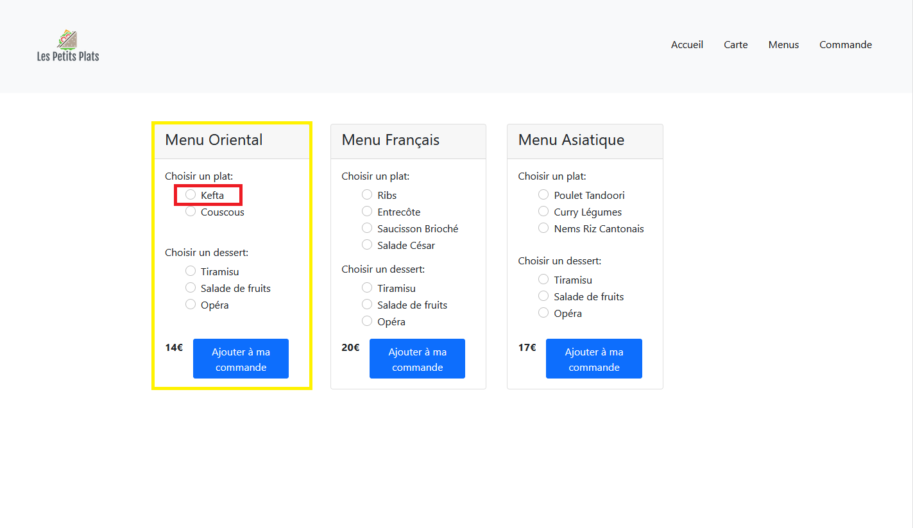

# TD6 - Passer les données en propriété des composants

## Introduction

Comme tous les autres frameworks javascript, React utilise  les propriétés (_props_) des éléments HTML pour transmettre les données aux composants :

`<Model name="toto" id="123" />` les _props_ sont récupérées comme ceci :

```
function Model(props) {
    return <div title={props.id}>{props.name}</div>; // affiche <div title="123">toto</div>
}
```

Cependant React recommande d'utiliser le _destructuring assignment_ pour récupérer les _props_, voir cet [article](https://developer.mozilla.org/fr/docs/Web/JavaScript/Reference/Op%C3%A9rateurs/Affecter_par_d%C3%A9composition#D%C3%A9composer_un_objet)

En voici un exemple :

```
function Model({name, id}) {
    return <div title={id}>{name}</div>;
}
```

LE code est plus concis et on voit directement quelles sont les propriétés attendues.

### Exercice

Dans _food.js_, créer un nouveau composant appelé _Card_ qui prend en paramètre un élément _food_ et retourne le code HTML de celui-ci:

```
const Card = ({food}) => {
  return (
    <div className="card w-25 mx-3 mb-4">
      
      <div className="card-body d-flex flex-column">
        <h5 className="card-title flex-grow-1">{food.title}</h5>
        <p className="card-text flex-grow-1">{food.description}</p>
        <div>
          <span className="fw-bold">{food.price}€</span>
          <a href="#" className="btn btn-primary mx-2">Ajouter à ma commande</a>
        </div>
      </div>
    </div>
  );
};
```

Utiliser ce composant dans _Food_ en passant la propriété comme ceci:

```
<Card food={food} />
```

Le rendu doit être identique au précédent.

## "Lifting state up"

Dans les concepts de base de React, [Lifting state up](https://reactjs.org/docs/lifting-state-up.html) est important et peut être appliquer aux autres frameworks Javascript (Angular, Vue).

Le but est d'éviter de gérer les données (state) un peu partout dans l'application. 

Pour cela, les données sont récupérées dans un composant principal (dans notre cas: App). Ce composant passera ces données dans les _props_ de ses sous-composants.

Ce concept est applicable pour les applications les plus simples. Dès qu'une application devient complexe, il faudra choisir d'autres mécanismes comme `useContext` ou `Redux`.

### Exercice

1. Déplacer le code récupérant les données _foodList_ depuis _food.js_ vers _App.js_.

Le composant _Food_ prendra en paramètre _foodList_. _App_ passera les données dans cette propriété.

2. Dans _App_, appeler l'API menu et initialiser le state _menuList_ de la même façon que _foodList_, avec _useState_ et _useEffect_

`http://cabe0232.odns.fr/webdev-api/menu`

3. Passer _foodList_ et _menuList_ dans les propriétés du composant _Menu_. La signature de ce composant sera donc 

```
export const Menu = ({foodList, menuList}) => {
  ...
};
```

4. Dans _menu.js_, transformer _menuList_ en une liste de _MenuCard_ correspondant aux menus du restaurant. 

Chaque menu comporte une partie des plats disponible à la carte: filtrer chaque plat pour que food.menuId corresponde à menu.id.

Pour les desserts, le client peut choisir n'importe lequel sur la carte (**ne pas filtrer les desserts par menuId**).

Voici la maquette, avec en jaune le composant _MenuCheckbox_ et en rouge le composant _MenuCard_ :




Pour l'instant, les checkbox ne sont pas utilisées et les boutons ne fonctionnent pas.

Voici le code HTML de _MenuCheckbox_ :

```
<div key={food.id} className="form-check">
  <input className="form-check-input" type="radio" name={`menu-${menu.id}-${food.category}`} id={`menu-${menu.id}-${food.id}`} />
  <label className="form-check-label" htmlFor={`menu-${menu.id}-${food.id}`}>
    {food.title}
  </label>
</div>
```

Voici le code HTML de _MenuCard_ :

```
<div className="card w-25 mx-3 mb-4">
  <div className="card-header">
    <h4 className="card-title">{menu.title}</h4>
  </div>
  <div className="card-body d-flex flex-column">
    <div className="flex-grow-1">
      <h6>Choisir un plat :</h6>
      <div>{mealsCheckbox}</div>
    </div>
    <div className="mt-3">
      <h6>Choisir un dessert :</h6>
      <div>{menusCheckbox}</div>
    </div>
    <div className="d-flex mt-3">
      <span className="fw-bold">{menu.price}€</span>
      <a href="#" className="btn btn-primary mx-3">Ajouter à ma commande</a>
    </div>
  </div>
</div>
```

Dans la fonction _map_, utilisez les _key_ suivantes: 

```
<MenuCheckbox key={`menu-${menu.id}-food-${food.id}`} menu={menu} food={food} />
```

```
<MenuCard key={`menu-${menu.id}`} menu={menu} foodList={foodList} />
```

