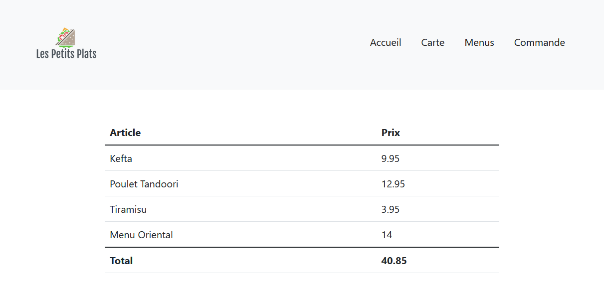
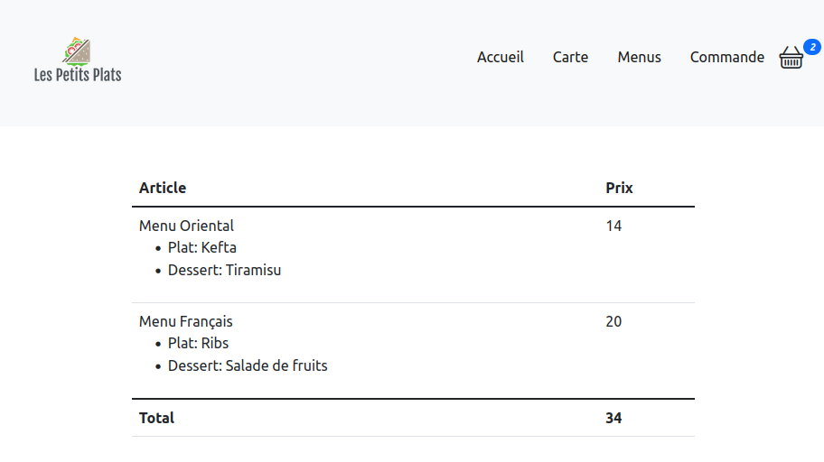

# TD9 - Finaliser le site

## Exercice 1

1. Dans le composant _order_, nous allons lister les menus et plats choisis.

Pour cela, utiliser [une table Bootstrap](https://getbootstrap.com/docs/5.1/content/tables/#variants).

Le composant _order_ prendra en props l'objet _cart_ défini dans _App_.

> Lorsque vous affichez le total, vous verrez peut-être des problèmes d'arrondi. Vous allez devoir appliquer Math.round pour arrondir à la 2ème décimal (problème inhérent à Javascript).

Le résultat devrait ressembler à ceci:

## Exercice 2

Les plats et desserts cochés pour chaque menu ne sont pas sauvegardés dans notre _cart_ et n'apparaissent pas dans notre commande.

1. Utiliser _onChange_ des boutons radios pour ajouter à l'objet menu de _cart_ le plat et le dessert sélectionné.

2. Bloquer le bouton "Ajouter à la commande" tant qu'un dessert et un menu ne sont pas sélectionnés. Utiliser la propriété _disabled_.

3. Dans _Order_, afficher pour chaque menu le plat et le dessert choisi

Le résultat devrait ressembler à ceci:

## Exercice 3

Nous allons à présent envoyer la commande au serveur.

1. Page admin

Créer une nouvelle page avec le composant `admin.js` fourni. Cette page vous permettra d'afficher et de supprimer les commandes créées.

2. Créer un bouton "Valider la commande" dans _Order_. 

Le bouton sera _disabled_ si la commande est vide.

Le clic construira l'objet commande et l'enverra au serveur.

3. Créer l'objet commande

L'objet à envoyer doit contenir les propriétés suivantes :

- id : un identifiant unique et aléatoire (UUID), que vous pourrez générer avec Math.random(). Générer un identifiant d'au moins 10 caractères pour éviter les collisions.
- description : description complète sous forme d'une chaine de caractère. Vous devez concaténer les noms des menus et des plats dans un format lisible.
- price : le prix total de la commande (type number)
- date : la date du jour
- client: votre nom

4. Envoyer la commande au serveur

Pour cela, utiliser _fetch_ afin d'envoyer une requête _POST_ à l'URL suivante :

http://cabe0232.odns.fr/webdev-api/order

Les données à envoyer sont au format JSON: vous devrez donc appliquer `JSON.stringify()` à votre objet avant de l'envoyer dans la requête.

5. Contrôler que le serveur renvoie bien `response.status === 200` et afficher le message "Commande enregistrée" si c'est le cas. Dans le cas contraire, afficher l'erreur. un nouveau state pour contenir le message à afficher.
 